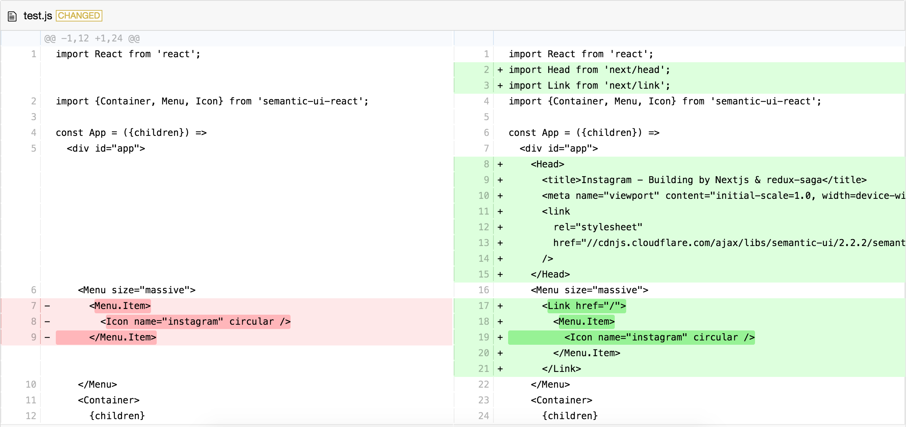

# react-gh-like-diff

[](https://www.npmjs.com/package/react-gh-like-diff)
[](https://github.com/neighborhood999/react-gh-like-diff/actions)
[](https://codeclimate.com/github/neighborhood999/react-gh-like-diff/maintainability)
[](https://codecov.io/gh/neighborhood999/react-gh-like-diff)
[](https://github.com/prettier/prettier)




> Generate Github like comparison based on [diff2html](https://github.com/rtfpessoa/diff2html).

You can compare string or given [unified diff](http://www.gnu.org/software/diffutils/manual/html_node/Example-Unified.html#Example-Unified) to generate pretty HTML.

## Demo

[](https://codesandbox.io/s/qvx7438xo6)

## Installation

```sh
yarn add react-gh-like-diff

# or

npm install react-gh-like-diff --save
```

## Configuration

[react-gh-like-diff](https://github.com/neighborhood999/react-gh-like-diff) is based on [diff2html](https://github.com/rtfpessoa/diff2html). The default configuration:

```js
const defaultOptions = {
  originalFileName: 'Unknown-File-Name',
  updatedFileName: 'Unknown-File-Name',
  inputFormat: 'diff',
  outputFormat: 'side-by-side',
  showFiles: false,
  matching: 'none',
  matchWordsThreshold: 0.25,
  matchingMaxComparisons: 2500,
  maxLineSizeInBlockForComparison: 200,
  maxLineLengthHighlight: 10000,
  renderNothingWhenEmpty: false
};
```

You can custom options for you want, just pass `options` as props. The configuration you can reference [here](https://github.com/rtfpessoa/diff2html#configuration). :mag_right:

## Style

Import css style make sure render correctly:

```js
import 'react-gh-like-diff/dist/css/diff2html.min.css';
```

You also can reference [examples](https://github.com/neighborhood999/react-gh-like-diff/blob/master/example/compare-markdown/src/App.js).

## Props

### past

> `string` | defaults to `''`

Passing past string as `past` prop with `current` prop for comparison.

### current

> `string` | defaults to `''`

Passing current string as `current` prop with `past` prop for comparison.

### diffString

> `string` | defaults to `''`

Passing unified diff as prop to generate pretty HTML.

### options

> `object` | optional, See [here](https://github.com/neighborhood999/react-gh-like-diff/blob/master/src/utils.js#L7)

Reference diff2html docs for [extra configuration](https://github.com/rtfpessoa/diff2html#configuration) setting.

## Inspiration

[nakajmg - gh-diff-html](https://github.com/nakajmg/gh-diff-html)

## LICENSE

MIT © [Peng Jie](https://github.com/neighborhood999)
